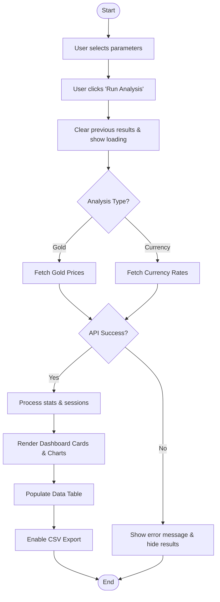
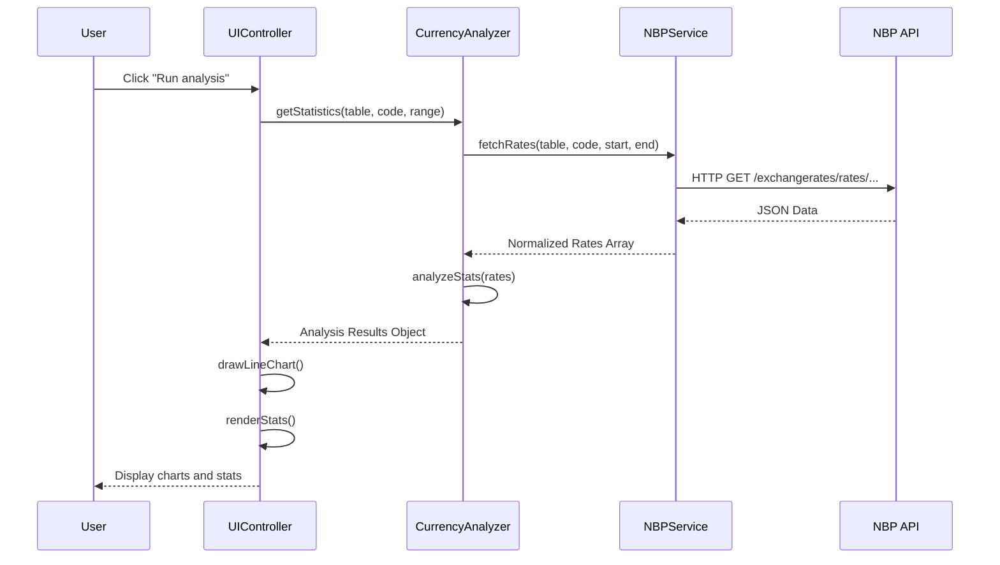

# Project UML Documentation

## 1. Activity Diagram (Analysis Workflow)
This diagram describes the logic flow of the `run()` function in the `UIController`.

## 2. Sequence Diagram (Component Interaction)
This diagram illustrates how different classes communicate during a standard currency analysis.

